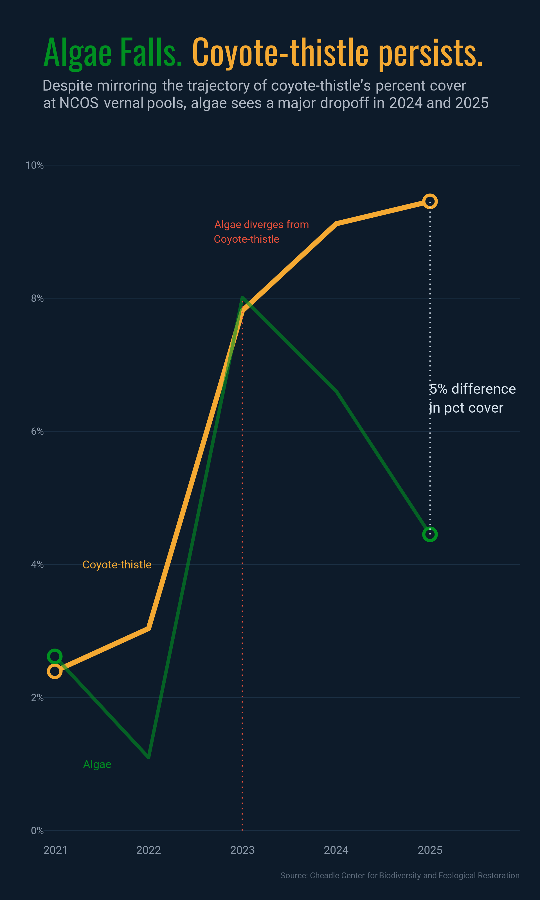

# Intermediate Elective 2

## General Information
This repository contains data and code to explore patterns in aquatic invertebrate abundance at North Campus Open Space.

To work with the code in this repository, you will need the following code chunk:

```
suppressPackageStartupMessages({
pacman::p_load(
  tidyverse, ggtext, showtext, 
  janitor, scales, glue,
  camcorder, here, magick
  )
})
```

## Data and file information

```
.
├── README.md
├── code                                          
│   ├── intermediate-elective.pdf
│   └── intermediate-elective.qmd
├── data
│   ├── veg.csv     # vegetation data
|   └── vp_veg_metadata.csv     # vernal pool metadata
├── temp_plots
│   └── visualization of final plots as png
├── utils
│   ├── base_theme.R
│   ├── fonts.R
│   ├── image_utils.R
│   ├── social_icons.R
└── intermediate-elective.Rproj
```

## Rendered Outpute

The rendered document for intermediate elective 2 is [here](https://github.com/EthanCastelazo/intermediate-elective/blob/3565b0e568416a1a08fc67627e2c523c53e9b793/code/intermediate-elective.pdf)

## Final Figure

